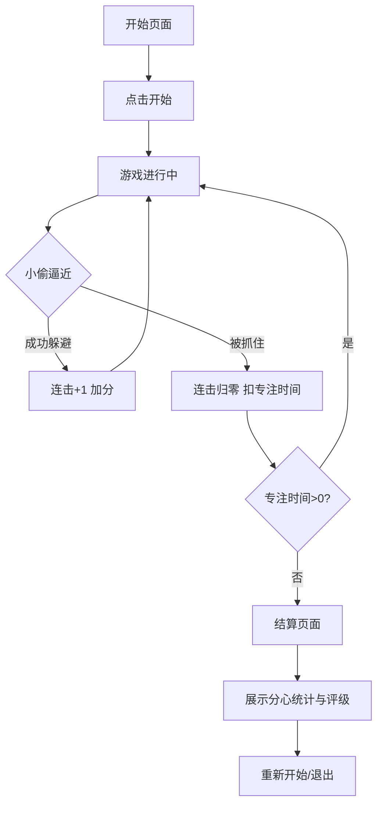

## 1. 产品概述

**时间小偷大逃亡**是一款以「专注力保护」为主题的四轨道跑酷小游戏。玩家扮演一个正在专注工作的角色，在四条任务轨道上奔跑，后方不断有时间小偷（代表各种分心因素：刷短视频、回消息、突然开会等）逼近，玩家需通过切换轨道或跳跃来躲避。成功连击躲避可加分，被抓住则扣除「专注时间」，一局结束后展示躲过的分心类型统计和评级，让玩家在欢笑中记住：别让小偷得逞。

- 目标用户：容易被手机/社交媒体分心的年轻上班族、学生
- 核心价值：用趣味游戏化方式提醒人们保护专注时间

## 2. 核心功能

### 2.1 游戏页面

| 页面名称 | 模块名称 | 功能描述 |
|----------|----------|----------|
| 开始页面 | 游戏标题与操作指引 | 展示游戏名称、简要玩法说明、开始按钮 |
| 游戏主页面 | 多轨道跑酷场景 | 四条任务轨道、主角奔跑、时间小偷逼近、HUD（分数/连击/专注时间） |
| 游戏主页面 | 操作控制 | 键盘方向键切换轨道（↑↓）、空格跳跃 |
| 游戏主页面 | 连击计分系统 | 连续躲避成功累加连击倍率，被抓住重置 |
| 游戏主页面 | 专注时间系统 | 初始专注时间倒计时，被小偷抓住扣除对应时间 |
| 结算页面 | 分心类型统计 | 列出本局躲过的各类型分心小偷及次数 |
| 结算页面 | 评级展示 | 根据分数和专注时间剩余给出S/A/B/C/D评级 |

### 2.2 时间小偷类型

| 小偷类型 | 图标 | 扣除专注时间 | 出现频率 | 特殊行为 |
|----------|------|-------------|----------|----------|
| 📱 刷短视频 | 手机图标 | 15秒 | 高 | 从右侧快速滑入 |
| 💬 回消息 | 聊天气泡 | 10秒 | 高 | 在轨道间突然弹出 |
| 📋 突然开会 | 文件夹图标 | 20秒 | 中 | 占据两条相邻轨道 |
| 🔔 通知提醒 | 铃铛图标 | 8秒 | 高 | 从上方落下 |
| 🎮 玩游戏 | 游戏手柄 | 18秒 | 低 | 在轨道上左右移动 |

## 3. 核心流程

1. 玩家点击「开始逃亡」进入游戏
2. 主角在四条轨道最前方奔跑，画面自动向左滚动
3. 时间小偷从右侧不断出现并逼近主角
4. 玩家通过↑↓键切换轨道、空格键跳跃躲避
5. 成功躲避：连击+1，分数按连击倍率累加
6. 被抓住：连击归零，扣除对应专注时间，主角闪烁
7. 专注时间归零则游戏结束
8. 结算页面展示统计数据与评级

## 4. 用户界面设计

### 4.1 设计风格

- **主色调**：深蓝夜色（#0a0e27）象征深夜专注时刻，霓虹绿（#00ff88）象征高效专注
- **辅色调**：霓虹粉（#ff2d7b）用于危险/小偷，霓虹黄（#ffe44d）用于连击高光
- **字体**：像素风字体（Press Start 2P）用于游戏标题与HUD，配合现代无衬线体用于说明文字
- **风格**：赛博朋克像素风，融合霓虹光效与复古8-bit元素
- **动画**：轨道流光效果、小偷接近时警告闪烁、连击时屏幕震动

### 4.2 页面设计概览

| 页面名称 | 模块名称 | UI元素 |
|----------|----------|--------|
| 开始页面 | 标题区 | 大像素风标题、霓虹绿发光效果、星星粒子背景 |
| 开始页面 | 操作指引 | 方向键图标+文字说明、跳跃键说明 |
| 开始页面 | 开始按钮 | 霓虹绿脉冲按钮 |
| 游戏主页面 | 轨道区 | 四条发光轨道线、滚动背景网格、远处城市剪影 |
| 游戏主页面 | 主角 | 像素小人奔跑动画、跳跃弧线轨迹 |
| 游戏主页面 | 时间小偷 | 各类型像素图标、接近时红色警告光晕 |
| 游戏主页面 | HUD | 左上角分数与连击、右上角专注时间进度条、底部操作提示 |
| 结算页面 | 统计区 | 分心类型列表+躲避次数、进度条式展示 |
| 结算页面 | 评级区 | 大号评级字母（S/A/B/C/D）、霓虹光效 |
| 结算页面 | 操作按钮 | 再来一局/返回首页 |

### 4.3 响应式

- 桌面端优先，Canvas 自适应窗口宽度
- 键盘为主要输入方式
- 移动端提供触屏按钮（上下切换轨道、跳跃）

### 4.4 视觉特效

- 轨道流光：霓虹色光线沿轨道方向流动
- 速度线：背景速度线随游戏进行加速
- 连击爆发：高连击时屏幕边缘光晕增强
- 被击中闪烁：主角闪红+屏幕微震
- 小偷逼近：距离近时轨道变红闪烁警告
