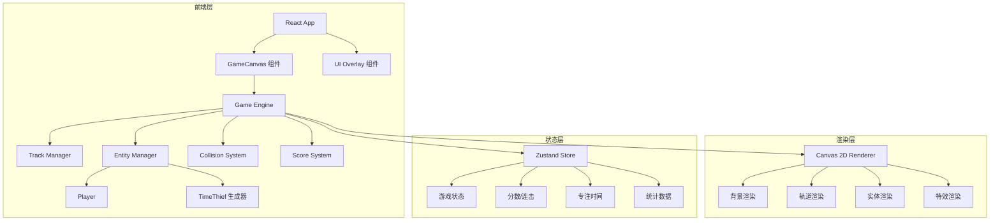

## 1. 架构设计



## 2. 技术说明

- **前端框架**：React@18 + TypeScript + Vite
- **样式方案**：Tailwind CSS@3
- **游戏渲染**：原生 Canvas 2D API（在 React 组件内管理）
- **状态管理**：Zustand（管理游戏状态、分数、统计数据）
- **后端**：无（纯前端游戏）
- **端口**：3017

## 3. 路由定义

| 路由 | 用途 |
|------|------|
| / | 游戏主页面（包含开始/游戏/结算三个阶段的切换） |

## 4. 项目结构

```
src/
├── components/
│   ├── GameCanvas.tsx        # Canvas 游戏渲染组件
│   ├── GameHUD.tsx           # 游戏 HUD（分数、连击、专注时间）
│   ├── StartScreen.tsx       # 开始界面
│   └── ResultScreen.tsx      # 结算界面
├── game/
│   ├── engine.ts             # 游戏主循环引擎
│   ├── player.ts             # 玩家角色逻辑
│   ├── thief.ts              # 时间小偷逻辑与生成
│   ├── tracks.ts             # 轨道管理
│   ├── collision.ts          # 碰撞检测
│   ├── renderer.ts           # Canvas 渲染器
│   ├── effects.ts            # 视觉特效
│   └── types.ts              # 游戏类型定义
├── store/
│   └── gameStore.ts          # Zustand 游戏状态
├── pages/
│   └── GamePage.tsx          # 游戏页面容器
├── App.tsx
└── main.tsx
```

## 5. 核心游戏机制

### 5.1 轨道系统
- 4条水平轨道，均匀分布在画布上
- 玩家通过↑↓键在轨道间切换，切换有平滑过渡动画
- 每条轨道有独立的霓虹发光效果

### 5.2 碰撞检测
- 矩形碰撞检测（AABB）
- 玩家与时间小偷在同一轨道且X轴重叠时判定碰撞
- 跳跃状态下Y轴偏移，可躲避地面小偷

### 5.3 连击系统
- 连续成功躲避：combo +1
- combo ≥ 3：分数 ×1.5
- combo ≥ 5：分数 ×2.0
- combo ≥ 10：分数 ×3.0
- 被击中：combo 归零，倍率重置为 ×1.0

### 5.4 难度递增
- 每30秒提升一个难度等级
- 小偷出现频率增加
- 小偷移动速度加快
- 高难度出现组合型小偷（占据双轨道）
